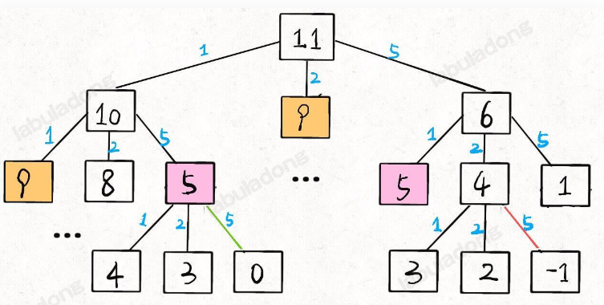
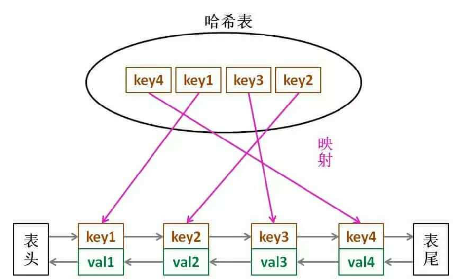

# 思想

**大部分算法可以看作对于二叉树的操作**

二叉树解题的思维模式分两类：

 **1、是否可以通过遍历一遍二叉树得到答案** ？如果可以，用一个 `traverse` 函数配合外部变量来实现，这叫「遍历」的思维模式。

 **2、是否可以定义一个递归函数，通过子问题（子树）的答案推导出原问题的答案** ？如果可以，写出这个递归函数的定义，并充分利用这个函数的返回值，这叫「分解问题」的思维模式。

无论使用哪种思维模式，你都需要思考：

 **如果单独抽出一个二叉树节点，它需要做什么事情？需要在什么时候（前/中/后序位置）做** ？其他的节点不用你操心，递归函数会帮你在所有节点上执行相同的操作。

* 比如快排是二叉树前序遍历

```java
void sort(int[] nums, int lo, int hi) {
    /****** 前序遍历位置 ******/
    // 通过交换元素构建分界点 p
    int p = partition(nums, lo, hi);
    /************************/

    sort(nums, lo, p - 1);
    sort(nums, p + 1, hi);
}
```

* 归并排序是二叉树后序遍历

```java
void sort(int[] nums, int lo, int hi) {
    int mid = (lo + hi) / 2;
    // 排序 nums[lo..mid]
    sort(nums, lo, mid);
    // 排序 nums[mid+1..hi]
    sort(nums, mid + 1, hi);

    /****** 后序位置 ******/
    // 合并 nums[lo..mid] 和 nums[mid+1..hi]
    merge(nums, lo, mid, hi);
    /*********************/
}
```

> **前中后序是遍历二叉树过程中处理每一个节点的三个特殊时间点**
>
> 1. 前序位置的代码在刚刚进入一个二叉树节点的时候执行；
> 2. 后序位置的代码在将要离开一个二叉树节点的时候执行；
> 3. 中序位置的代码在一个二叉树节点左子树都遍历完，即将开始遍历右子树的时候执行。

## 两大框架

### 回溯框架【遍历】

#### DFS

DFS 的关注点在单个 **节点**

```java
// DFS 算法把「做选择」「撤销选择」的逻辑放在 for 循环外面
void dfs(Node root) {
    if (root == null) return;
    // 做选择
    print("我已经进入节点 %s 啦", root)
    for (Node child : root.children) {
        dfs(child);
    }
    // 撤销选择
    print("我将要离开节点 %s 啦", root)
}
```

#### 回溯

回溯算法的关注点在节点间的 **树枝**

```java
// 回溯算法把「做选择」「撤销选择」的逻辑放在 for 循环里面
void backtrack(Node root) {
    if (root == null) return;
    for (Node child : root.children) {
        // 做选择
        print("我站在节点 %s 到节点 %s 的树枝上", root, child)
        backtrack(child);
        // 撤销选择
        print("我将要离开节点 %s 到节点 %s 的树枝上", child, root)
    }
}
```

站在一个节点上我们需要考虑三个问题：

1. 路径：也就是已经做出的选择。

2. 选择列表：也就是你当前可以做的选择。

3. 结束条件：也就是到达决策树底层，无法再做选择的条件。

#####  排列组合

分为三种情况：

1. **元素无重不可复选** (基础)

   ```js
    const backtrack = (start) => {
           // 前序遍历位置，每个节点的值都是一个子集
           result.push([...onPath]);
           
           // 回溯算法 --- 组合
           for (let i = start; i < nums.length; i++) {
               onPath.push(nums[i]);
               backtrack(i + 1);// 回溯遍历下一层节点
               onPath.pop();
           }
       };
   ```

   * <u>不可复选，则start代表从索引start开始选，无需考虑前面的因为已经选过了。</u>

2. **元素可重不可复选**

   ```js
   nums.sort((a,b)=>a-b); //排序
   //... ...
   const backtrack = (start=0) => {
           // 前序遍历位置，每个节点的值都是一个子集
           result.push([...onPath]);
           
           // 回溯 --- 组合
           for (let i = start; i < nums.length; i++) {
               if(i>start && nums[i]==nums[i-1]) continue; //剪枝
               onPath.push(nums[i]);
               backtrack(i + 1);// 回溯遍历---从下一个元素开始
               onPath.pop();
           }
       };
   ```

   * <u>因为元素可重但是选择不可重，所以需要剪枝。</u>
   * 先给nums排序，方便后面剪枝

3. **元素无重可复选**

   ```js
   nums.sort((a,b)=>a-b); //排序
   //... ...
   const backtrack = (start=0) => {
           // 前序遍历位置，每个节点的值都是一个子集
           result.push([...onPath]);
           
           // 回溯 --- 组合
           for (let i = start; i < nums.length; i++) {
               //剪枝
               onPath.push(nums[i]);
               backtrack(i);// 回溯遍历---从此元素开始
               onPath.pop();
           }
       };
   ```

   


#### BFS

层序遍历属于迭代遍历

```java
// 输入一棵二叉树的根节点，层序遍历这棵二叉树
void levelTraverse(TreeNode root) {
    if (root == null) return;
    Queue<TreeNode> q = new LinkedList<>();
    q.offer(root);
	let depth = 0;
    // 从上到下遍历二叉树的每一层
    while (!q.isEmpty()) {
        int sz = q.size();
        // 从左到右遍历每一层的每个节点
        for (int i = 0; i < sz; i++) {
            TreeNode cur = q.poll();
            // 将下一层节点放入队列
            if (cur.left != null) {
                q.offer(cur.left);
            }
            if (cur.right != null) {
                q.offer(cur.right);
            }
        }
        depth ++ ;
    }
}
```

#### 变形递归

##### 二叉当作三叉

```js
// 三叉树遍历框架
function traverse(node1, node2) {
    if (node1 === null || node2 === null) {
        return;
    }
    /**** 前序位置 ****/
    // 将传入的两个节点穿起来
    node1.next = node2;
  
    // 连接相同父节点的两个子节点
    traverse(node1.left, node1.right);
    traverse(node2.left, node2.right);
    // 连接跨越父节点的两个子节点
    traverse(node1.right, node2.left);
}
```

##### 从右向左的中序-倒序二叉搜索树

```js
var traverse = function(root) {
    if (root == null) return;
    // 先递归遍历右子树
    traverse(root.right);
    // 中序遍历代码位置
    console.log(root.val);
    // 后递归遍历左子树
    traverse(root.left);
}
```

### 动规框架【分解】

```python
# 自顶向下递归的动态规划
def dp(状态1, 状态2, ...):
    for 选择 in 所有可能的选择:
        # 此时的状态已经因为做了选择而改变
        result = 求最值(result, dp(状态1, 状态2, ...))
    return result
```

```python
# 自底向上迭代的动态规划
# 初始化 base case
dp[0][0][...] = base case
# 进行状态转移
for 状态1 in 状态1的所有取值：
    for 状态2 in 状态2的所有取值：
        for ...
            dp[状态1][状态2][...] = 求最值(选择1，选择2...)
```


> 动态规划问题必须符合 **最优子结构**
>
> 例如换零钱： 面值分别为 1，2，5，用最少硬币凑到总金额 `amount = 11`
>
> 子结构就是 凑到 10, 9, 6 的硬币数+12
>
> **子问题必须独立**
>
> 因为每种硬币无限多，即凑到10元的结果，不影响凑到9元的结果

<div style="color:red"><b>总结</b></div>

对于动态规划的题目， 题目求什么，`dp[i][j]` 的值就代表什么。

#### DP树



#### 压缩

**如果计算状态 `dp[i][j]` 需要的都是 `dp[i][j]` 相邻的状态，那么就可以使用空间压缩技巧**


# 链表

- 双指针
- 虚拟头节点: 需要创建新链表时

## 反转链表

递归方式

> **输入一个节点 `head`，将「以 `head` 为起点」的链表反转，并返回反转之后的头结点** 。

```java
ListNode reverse(ListNode head) {
    if (head == null || head.next == null) {
        return head;
    }
    ListNode last = reverse(head.next);
    head.next.next = head;
    head.next = null;
    return last;
}
```

## 大根堆

求 n 个数字中的最大值

- 由数组构成的完全二叉树
- 两个功能: 插入和弹出
  - 插入: 插入队尾,队尾冒泡
  - 弹出: 队头和队尾交换,弹出队尾,队头下沉
  - > 所有操作都在头尾
    >

```java
public class MaxPQ
    <Key extends Comparable<Key>> {
    // 存储元素的数组
    private Key[] pq;
    // 当前 Priority Queue 中的元素个数
    private int size = 0;

    public MaxPQ(int cap) {
        // 索引 0 不用，所以多分配一个空间
        pq = (Key[]) new Comparable[cap + 1];
    }

    /* 返回当前队列中最大元素 */
    public Key max() {
        return pq[1];
    }

    /* 插入元素 e
    要插入的元素添加到堆底的最后，然后让其上浮到正确位置。
 */
    public void insert(Key e) {...}

    /* 删除并返回当前队列中最大元素
    堆顶元素 A 和堆底最后的元素 B 对调，然后删除 A，最后让 B 下沉到正确位置。 */
    public Key delMax() {...}

    /* 上浮第 x 个元素，以维护最大堆性质 */
    private void swim(int x) {
        // 如果浮到堆顶，就不能再上浮了
        while (x > 1 && less(parent(x), x)) {
            // 如果第 x 个元素比上层大
            // 将 x 换上去
            swap(parent(x), x);
            x = parent(x);
        }
    }

    /* 下沉第 x 个元素，以维护最大堆性质 */
    private void sink(int x) {
        while (left(x) <= size) {
            // 先假设左边节点较大
            int max = left(x);
            // 如果右边节点存在，比一下大小
            if (right(x) <= size && less(max, right(x)))
                max = right(x);
            // 结点 x 比俩孩子都大，就不必下沉了
            if (less(max, x)) break;
            // 否则，不符合最大堆的结构，下沉 x 结点
            swap(x, max);
            x = max;
        }
    }

    /* 交换数组的两个元素 */
    private void swap(int i, int j) {...}

    /* pq[i] 是否比 pq[j] 小？ */
    private boolean less(int i, int j) {
        return pq[i].compareTo(pq[j]) < 0;
    }

    /* 还有 left, right, parent 三个方法
    分别表示节点的左儿子、右儿子、父亲 */
}
```

> 注意 js 除法不会自动取整

## 倒数第 k 个

- 双指针
  - p1 走出 k 步之后, p1 和 p2 再同步移动
    > 只用遍历一次链表
    >

## 链表-环

- 双指针
  - p1 走一步,p2 走两步, while 循环
    - 如果 p2 === null, 说明没有环
    - 如果 p2 === p1 , 说明有环

## 返回两链表相交点

> p1 = [1,2,3,4]
> p2 = [a,b,c,3,4]
> 则 3 是相交点
> p1+p2 = [1,2,3,4,a,b,c,3,4]
> p2+p1 = [a,b,c,3,4,1,2,3,4]

- 拼接 p1+p2 和 p2+p1
  - 此时两个链表同步遍历下去, 若遇到两者相同的节点,则它就是相交点

# 数组

## 差分

* 维护一个差分数组 `diff[n] = arr[n] - arr[n-1]`
* 主要适用场景是频繁对原始数组的某个**区间**的元素进行**增减** 。

> 例如：在 [ i , j ] 之间 所有元素都加1
> 只需要 diff[ i ] += 1 ; diff[ j+1 ] -= 1;

## 遍历

* 旋转矩阵
  * 沿着主对角线对折后，再rever每行元素 = 顺时针旋转90°
* 螺旋遍历矩阵
  1. 用一个d 和 一个flag 辅助数组 遍历 ， 空间复杂度O(m*n)

     ```js
     const d = {
         0: [0, 1],
         1: [1, 0],
         2: [0, -1],
         3: [-1, 0]
     }
     ```
  2. 空间复杂度O(1)

     ```js
         var upper_bound = 0, lower_bound = m - 1;
         var left_bound = 0, right_bound = n - 1;
     ```

> T54  T54

## 滑动窗口

```js
const window = new Map()
let left = 0, right = 0;
let valid = 0; //记录收集完成的字母的数量

while (left < right && right < s.length) {
    // 增大窗口
    window.set(s[right], window.get(s[right])?window.get(s[right])+1: 1);
    right++;
  
    while (window needs shrink) {
        // 缩小窗口
        window.set(s[left], window.get(s[left])-1);
        left++;
    }
}
```

## 二分搜索

* 防止溢出 `(l+r)/2 === l + (r - l)/2`

### 左侧边界优先二分搜索

不同的二分搜索对于 `[1,2,2,2,3]` return 2 而不是 1

```js
function left_bound_binary_search (nums, target) {
    let left = 0, right = nums.length - 1;
    // 搜索区间为 [left, right]
    while (left <= right) {
        let mid = left + ((right - left) >> 1);
	if (nums[mid] == target){
            // 收缩右侧边界 ⭐不return
            right = mid - 1;
	} else if (nums[mid] < target) {
            // 搜索区间变为 [mid+1, right]
            left = mid + 1;
        } else if (nums[mid] > target) {
            // 搜索区间变为 [left, mid-1]
            right = mid - 1;
        }
    }
    // 判断 target 是否存在于 nums 中
    // 如果越界，target 肯定不存在，返回 -1
    if (left < 0 || left >= nums.length) {
        return -1;
    }
    // 判断一下 nums[left] 是不是 target
    return nums[left] == target ? left : -1;
};
```

### 右侧边界优先二分搜索

```js
function right_bound_binary_search (nums, target) {
    let left = 0, right = nums.length - 1;
    while (left <= right) {
        int mid = left + (right - left) >> 1;
	if (nums[mid] == target){
            //【区别1】
            left = mid + 1;
	} else if (nums[mid] < target) {
            left = mid + 1;
        } else if (nums[mid] > target) {
            right = mid - 1;
        }
    }
    // 【区别2】
    if (right < 0 || right >= nums.length) {
        return -1;
    }
    // 【区别3】
    return nums[right] == target ? right : -1;
};

```

## 对于时间要求O(n) 空间要求O(1)

1. 可以使用常数次for遍历
2. 可以利用原本数组原地修改


# 树

### 二叉搜索树

* 搜索

```js
var BST = function(root, target) {
    if (root.val === target) {
        // 找到目标，做点什么
    }
    if (root.val < target) { 
        BST(root.right, target);
    }
    if (root.val > target) {
        BST(root.left, target);
    }
};
```

* 插入

```js
var insertIntoBST = function(root, val) {
    // 找到空位置插入新节点
    if (root === null) return new TreeNode(val);
    // if (root.val == val)
    //     BST 中一般不会插入已存在元素
    if (root.val < val) 
        root.right = insertIntoBST(root.right, val);
    if (root.val > val) 
        root.left = insertIntoBST(root.left, val);
    return root;
}
```

* 删除

```js
/**
 * 删除 BST 中的一个节点并返回根节点。
 * @param {TreeNode} root - 二叉树的根节点。
 * @param {number} key - 待删除节点的值。
 * @return {TreeNode} - 删除节点后的 BST。
 */
var deleteNode = function(root, key) {
    if (root == null) return null;
    if (root.val == key) {
        // 这两个 if 把情况 1 和 2 都正确处理了
        if (root.left == null) return root.right;
        if (root.right == null) return root.left;
        // 处理情况 3
        // 获得右子树最小的节点
        let minNode = getMin(root.right);
        // 删除右子树最小的节点
        root.right = deleteNode(root.right, minNode.val);
        // 用右子树最小的节点替换 root 节点
        minNode.left = root.left;
        minNode.right = root.right;
        root = minNode;
    } else if (root.val > key) {
        root.left = deleteNode(root.left, key);
    } else if (root.val < key) {
        root.right = deleteNode(root.right, key);
    }
    return root;
}

/**
 * 获得 BST 中最小的节点。
 * @param {TreeNode} node - 待查找 BST。
 * @return {TreeNode} - BST 中最小的节点。
 */
var getMin = function(node) {
    // BST 最左边的就是最小的
    while (node.left != null) node = node.left;
    return node;
}
```

# 图

## dfs遍历

```js
var visited = [];
var onPath = [];

/* 图遍历框架 */
function traverse(graph, s) {
    if (visited[s]) return;
    // 经过节点 s，标记为已遍历
    visited[s] = true;
    // 做选择：标记节点 s 在路径上
    onPath[s] = true;
    for (var i = 0; i < graph.neighbors(s).length; i++) {
        var neighbor = graph.neighbors(s)[i];
        traverse(graph, neighbor);
    }
    // 撤销选择：节点 s 离开路径
    onPath[s] = false;
}
```

> 图的拓扑排序就是图的dfs后序排序再reverse

## 判断环

### 基于dfs，通过onPath.includes(cur)判断

```js
var findOrder = function (numCourses, prerequisites) {
    const visited = new Array(numCourses).fill(false)
    const onPath = [];
    const graph = generateGraph(numCourses, prerequisites)
    let hasCircle = false;

    for (let i = 0; i < numCourses; i++) {
        dfs(i)
    }
 
    return hasCircle 

    function dfs(cur) {
        if (onPath.includes(cur))//判断是否有环
            hasCircle = true;
        if (visited[cur] || hasCircle) 
            return;
        visited[cur] = true;
        onPath.push(cur)
        let p = graph[cur].next;
        while (p) {
            dfs(p.val);
            p = p.next;
        }
        onPath.pop();
    }
};
```

### 基于拓扑排序 拓扑顺序count===num

## 拓扑排序

* **dfs后序遍历再翻转**
* **基于bfs**

```js
    // 构建邻接表、入度数组
    let indegree = new Array(numCourses).fill(0);
    let graph = buildGraph2(numCourses, prerequisites, indegree);
    // 初始化，入度为0直接加入队列中
    let q = [];
    for (let i = 0; i < numCourses; i++) {
        if (indegree[i] == 0) {
            q.push(i);

        }
    }

    // 开始执行 BFS 循环
    while (q.length > 0) {
        // 弹出一个节点，代表遍历了一个节点。
        let cur = q.shift();
        let p = graph[cur].next;
        while (p) {
            indegree[p.val]--; 
            if (indegree[p.val] === 0) { //此节点入度为0，可以入队
                q.push(p.val)
            }
            p = p.next;
        }
    }
 
```

> 拓扑排序与dfs区别：使用indegree[]而不是visited[]


# 背包

## 0-1背包

要么装进包里，要么不装，不能说切成两块装一半

```js
// 对于前 i 个物品（从 1 开始计数），当前背包的容量为 w 时，这种情况下可以装下的最大价值是 dp[i][w]。
const dp[N+1][W+1]
dp[0][..] = 0
dp[..][0] = 0

for i in [1..N]:
    for w in [1..W]:
        dp[i][w] = max(
            把物品 i 装进背包,
            不把物品 i 装进背包
        )
return dp[N][W]
```


## 完全背包

一个物品可以装进无限次，也可以不装


# 处理循环数组

1. 下标取余
2. 复制一份再首尾连接起来


# LRU

最近最旧未使用




